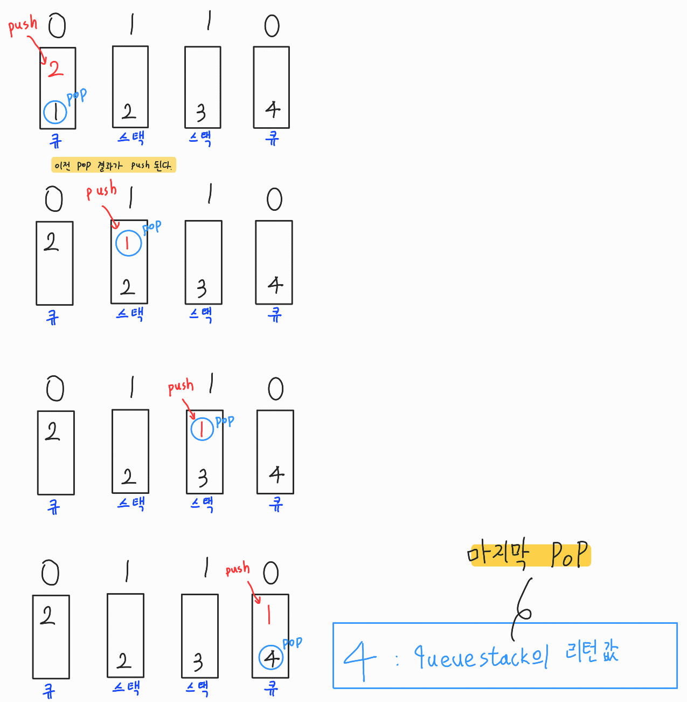

# 1. 2주차 코드 리뷰
##### 모든 코드는 c++로 작성하였습니다.

## queuestack - (24511번) 난도 : 실버 III
[제언] 문제의 기술형태가 매우 좋지 않아 이해하는데 꽤나 시간이 걸렸다. 문제를 그림을 통해 표현하면 쉽게 접근할 수 있었다.

[풀이]
_*독특한 계산기 구현방식*_
사진을 통해 정리하면 문제를 쉽게 이해할 수 있고, 각각 독립적으로 자료구조가 생긴다는 것만 인지하면된다. 핵심은 그림을 그리다보면 스택은 전혀 고려할 필요가 없다는 것을 알 수 있게 된다. 그저 큐일때 상황만 따지면서 덱으로 양방향 송출을 해주면 된다.

## 프린터 큐 - (1966번) 난도 : 실버 III
사용 개념 : 우선순위 큐, pair, 큐

[제언] 문제 자체는 아주 쉬운 편이라 접근하기는 쉽지만 큐 안에서 우선순위를 매겨서 이를 처리하기에는 다소 어려운 개념이 포함되었다. 

[풀이]
Priority_Queue와 pair_Queue가 독립적으로 시행되는데 이를 어떻게 하면 엮어서 처리할 수 있을지가 관점이었고, pair_Queue를 Priority_Queue를 push, pop을 이용해서 같을 때만 엮어주는 방식으로 한 후 count하면 이를 풀 수 있게 된다.

## 덱 - (10866번) 난도 : 실버 IV
[제언] 덱의 매우 기초적인 개념으로 덱은 양방향으로 PUSH, POP이 된다는 성질을 익히는게 중요할 것 같다.

[풀이]
따로 코드를 통해 얻어갈 것은 없고 c++에서 stl을 이용해 덱을 구현할 때, deque<int> dq; 와 front와 back을 이용한다는 것을 알면 될 것 같다.

## 큐2 - (18258번) 난도 : 실버 IV
[제언] 큐의 매우 기초적인 개념으로 큐는 back 방향으로 PUSH, POP이 된다는 성질을 익히는게 중요할 것 같다.

[풀이]
따로 코드를 통해 얻어갈 것은 없고 c++에서 stl을 이용해 큐를 구현할 때, queue<int> q; 을 이용한다는 것만 알면 될 것 같다.

## 독특한 계산기 - (19591번) 난도 : 골드 III

[제언] 문제도 어렵고 지문도 어렵고 쉬운게 하나도 없었다. 고려해야할 조건도 매우 많고 예제조차 설명이 제대로 나와있지않아 적용하면 이를 해결하기도 어려웠다. 하나하나씩 조건문을 걸어가면서 주어진 조건을 해결하면 된다.

[풀이] 우선 int의 범위인 2^31을 넘어가기 때문에 자료형을 long long으로 받아줘야한다. 이후 조건을 하나하나씩 해결하면 되는데 이를 다 풀어내기에는 글이 길어질 것 같기때문에 이후 과정은 코드로 대신한다.

   