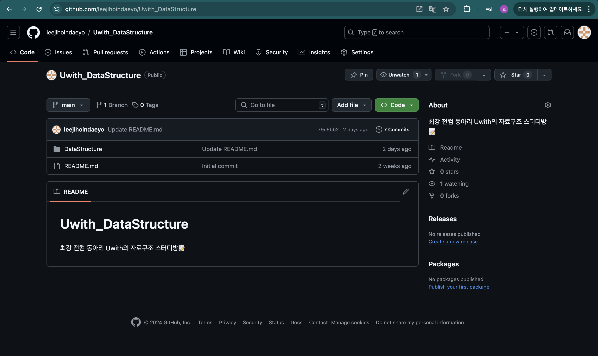
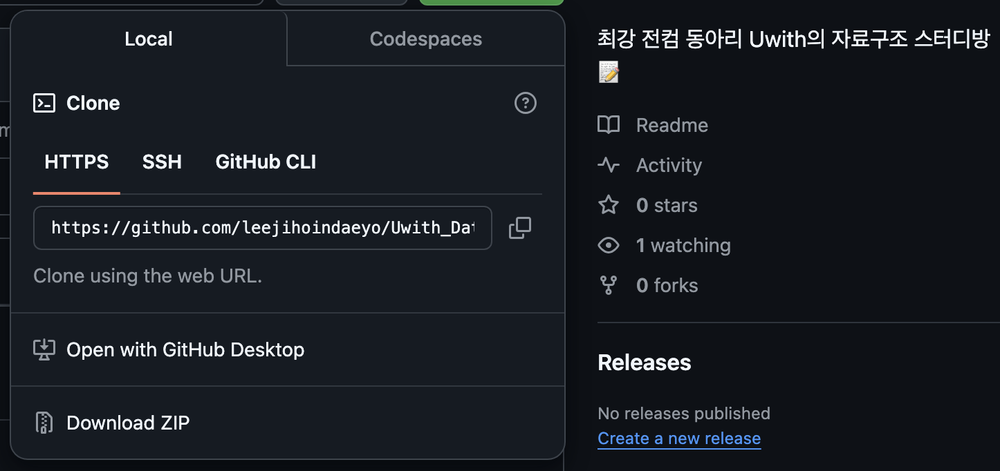
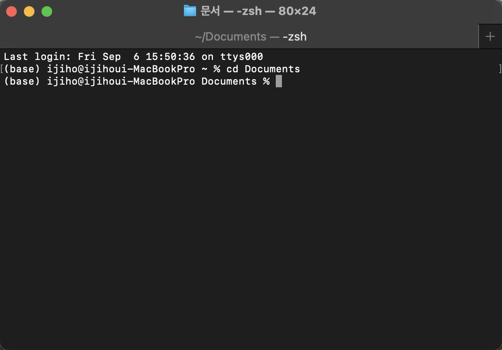
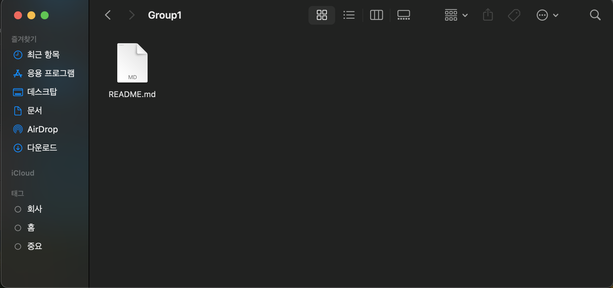
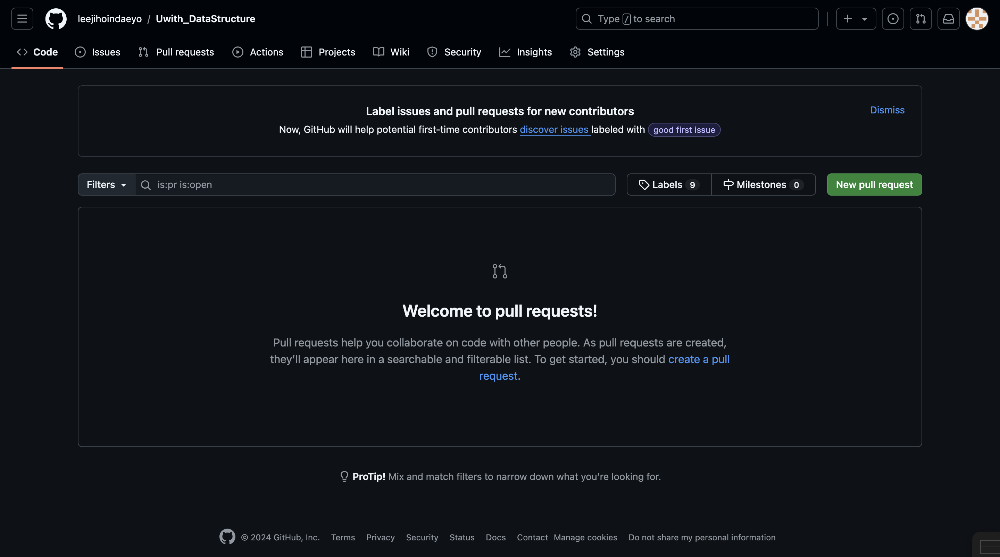

# (필독) Github에 소스 코드와 README.md 파일은 어떻게 올리나요?

다시 한 번 인사드립니다. 유위드 회장이에요!

사실 이번 스터디는 오로지 자료구조만을 위한 스터디는 아닙니다. 

깃허브 사용을 어느정도 할 수 있으면 향후 진행할 프로젝트에서도 상당히 용이하게 쓸 수 있습니다. 

무엇보다 좋은 점은 Github 레포지토리 자체가 스펙이 될 수 있다는 점이 가장 좋죠. 

개발자로 취직을 하기 위해서는 이력서에 포트폴리오를 제출하는 곳이 간혹 가다 있는데 본인의 Github를 포트폴리오에 넣어 제출한다면 결과물도 뚜렷하게 볼 수 있어 담당자가 평가할 때 좋은 요소가 될 수 있습니다.

또한, 개발 회사에서는 우리가 앞으로 소스코드를 올리는 방법과 같이 본인이 오늘 한 과업에 대해 Commit을 합니다. (저도 인턴을 하면서, 실제로 Github로 오늘 한 과업 내용을 보고했습니다.)

그래서 이번엔 자료구조 스터디에서 가장 중요한 소스 코드, 마크다운 파일을 올리는 방법에 대해 알려드리고자 합니다.

예시는 저희가 앞으로 사용할 Git 공간을 예시로 들어서 할 예정입니다.

**참고로 저는 맥을 사용합니다..! (맥 최고~)**

# 1. 준비물

- 여러분이 작성한 소스코드 (언어는 상관 없어요)
- 마크다운 파일 (.md)
- 여러분의 노트북

# 2. 과정을 들어가기 전 “브랜치”라는 용어를 알아야 한다.

**- 브랜치란?**

: 브랜치 (Branch)의 원래 단어는 가지라고 하죠. 제가 만든 깃 저장소를 하나의 나무라고 봅시다.

나무가 되기 위해서는 가지가 여러 가지가 합쳐져야 하죠?

깃허브 저장소가 채워지는 원리는 가지가 합쳐져서 나무가 된다는 원리라고 보시면 됩니다.

여러분 개개인이 브랜치를 만들어 본인의 소스코드와 마크다운 파일을 올리면,

제가 시간이 날 때 여러분들의 브랜치를 메인에 Merge를 하며 나무를 만들겁니다.

# 3. 이젠 진짜로 과정을 들어가봅시다.

**(주의) 과정을 들어가기 전 토큰 발급을 무조건 하세요. 그리고… 토큰 복사 무조건 해주시고 까먹으면 다시 발급해야하는 번거로움이 있기 때문에 notepad에 저장 잘해주세요. 토큰 발급 방법은… 손쉽게 인터넷 서핑으로 찾을 수 있습니다.**

### 1. 먼저 저희가 올릴 깃허브 저장소를 복제합니다.

저희의 깃 저장소는 여기 있습니다.



여기서 `<>code`  블록을 가면, URL을 복사할 수 있는 블록이 있는데 이를 복사하세요.


그리고, cmd 창(맥의 경우에는 터미널)을 들어가세요.

여러분이 가장 많이 쓰는 저장 공간으로 디렉토리를 옮기세요 (**아마 윈도우도 cd였던 거 같은데**)

저같은 경우엔 문서를 자주 쓰기에 문서로 디렉토리 위치로 설정했습니다.



그 다음 다음의 명령어를 쳐주세요

```jsx
git clone https://github.com/leejihoindaeyo/Uwith_DataStructure.git
```

그러면 여러분들이 위치를 옮긴 디렉터리에 다음과 같이 폴더가 나올 겁니다. 앞으로 여기에 소스코드를 옮긴 후 커밋을 할겁니다.


### 2. 이제 파일을 올려봅시다.

먼저 소스코드와 마크다운 파일을 바탕화면에 저장하세요. 저장을 잘못했을 경우 소스코드가 날아가는 현상이 발생하기에 미리 준비하는 겁니다. (사람은 실수를 하기 마련이니까요)

### 0. 여기서 또 주의할 점! git pull

**18명의 인원이 매번 커밋을 하기 때문에 저장소의 내용이 매번 바뀝니다. 따라서, 매주 커밋을 하기 전 본인의 저장소를 pull 해주세요. 브랜치만큼 중요합니다!**

### 1. git checkout

코드를 올리기 전 본인의 브랜치를 팝니다. 브랜치명은 본인 하고 싶은대로 하시면 됩니다. (보통 이름으로 많이 하긴 함)

```tsx
git checkout -b [브랜치명]
```

이 코드는 브랜치 생성과 함께 본인의 브랜치로 이동을 합니다.

### 2. git add

파일을 놓았으면 커밋할 준비를 합니다. 커밋할 파일을 추가하는 명령어 입니다.

먼저, 각자 조에 맞는 파일로 디렉터리를 이동한 다음 (cd 디렉토리명) 그 위치에 파일을 놓으세요.

저는 Group1 디렉토리에 [README.md](http://README.md) 파일을 하나 커밋할 겁니다.



그 다음 다음과 같은 명령어를 입력하세요.

```tsx
git add [파일명] (파일명 대신 .을 치면 모든 파일 add, 추천은 안 함)
```

### 3. git commit

add한 파일을 이제 저장소로 커밋할 겁니다.

```tsx
git commit -m "커밋 메시지" 파일명
```

### 4. git push

본인의 브랜치에서 push 하세요. 그러면 Github에 Pull Request에 본인이 올린 커밋 사항이 있을 겁니다.

```tsx
git push origin 브랜치명
```

### 5. PR

Github 사이트에 Pull Request가 있습니다. 여기에서 최종적으로 PR을 날리세요


아 PR 날릴 때 Title 꼭 이렇세 써주세요

```tsx
이지호 n주차 문제풀이 제출합니다.
```

이래야 누가 잘 풀었는지 볼 수 있어요.

처음 해보시면 상당히 어려울겁니다. 저도 엄청 어려워했어요. 무슨 말인지 모르겠으면 다음 사이트에서 확인해보세요.

[추가 정보] https://sudo-minz.tistory.com/10

또한, 본인의 진행 상황에 대해 알고 싶으면, 다음 명령어를 입력하세요

```tsx
git status
```

궁금한 점 있으시면, 저한테 주저하지 말고 물어보세요! 화이팅입니다 ㅎㅎ